# AI Gateway

一个功能完整的 AI Gateway 项目，用于管理和代理多种 AI 服务（OpenAI、Gemini、Claude 等），提供统一的管理界面和丰富的内置工具。

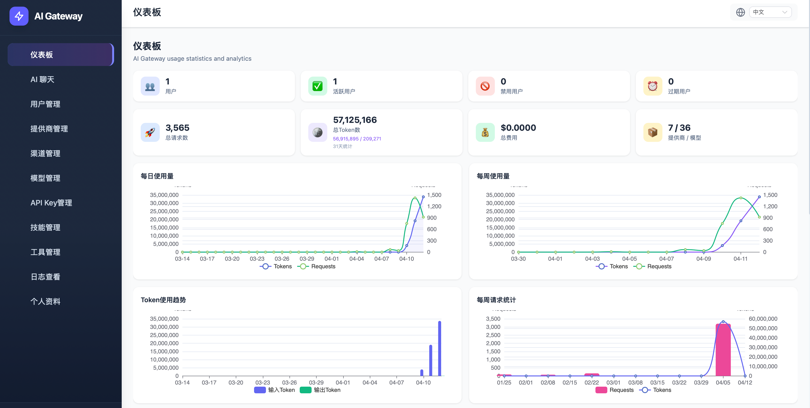

## 功能特性

### 核心网关功能
- **多提供商支持**: OpenAI、Gemini、Claude 等多种 AI 服务提供商
- **智能路由**: 基于权重的随机路由选择，支持自动禁用失败路由
- **协议转换**: 支持 OpenAI/Claude/Gemini 三种协议之间的自动转换
- **直传模式**: 对于 OpenAI 兼容的后端，支持请求直传，保持原始 JSON 格式
- **认证授权**: JWT 认证、API Key 认证、TOTP 双因素认证
- **计费系统**: 基于 Token 的成本计算和余额管理
- **日志记录**: 完整的请求日志和详情记录，支持 GZIP 压缩存储
- **代理支持**: HTTP/HTTPS 代理，支持 NO_PROXY 和 CIDR 配置

### AI 聊天功能
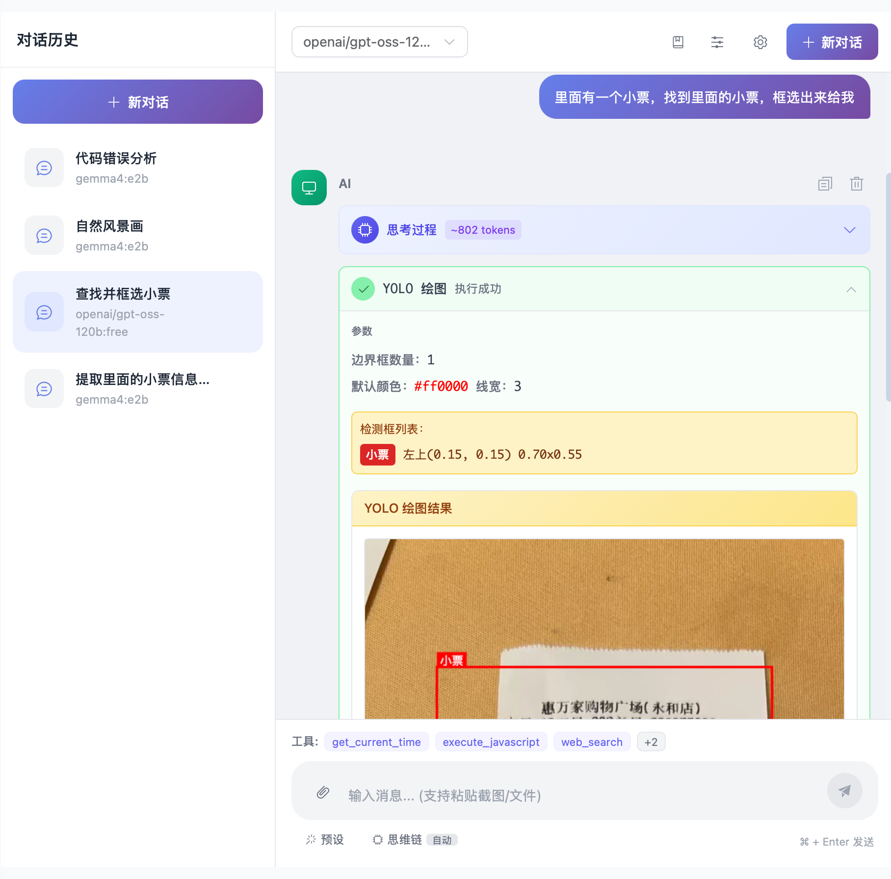

- **多模型切换**: 支持在对话中切换不同的 AI 模型
- **思维链控制**: 
  - 支持 OpenAI `reasoning_effort` 参数（none/minimal/low/medium/high）
  - 支持 Gemini `thinkingLevel` 参数（minimal/low/medium/high）
  - 支持 Claude Thinking config（enabled/disabled + budget_tokens）
  - 三种协议间的思考配置自动映射转换
- **技能系统**: Agent Skills 支持，可扩展 AI 能力
- **内置工具**: 提供丰富的内置工具，无需用户编写代码
- **自定义工具**: 支持用户创建自定义工具（JavaScript 执行）
- **流式响应**: 实时显示 AI 思考过程和工具调用
- **响应式界面**: 支持移动端和桌面端，小屏幕优化显示

### 内置工具
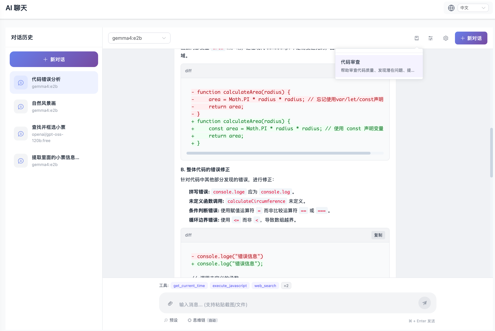

| 工具 | 功能说明 |
|------|----------|
| `get_current_time` | 获取当前时间和日期 |
| `get_location` | 获取用户当前地理位置（需要用户授权） |
| `execute_javascript` | 执行 JavaScript 代码（计算、数据处理） |
| `web_search` | 网络搜索（通过后端代理 Google） |
| `fetch_webpage` | 获取网页内容 |
| `web_canvas` | Canvas 2D 绘图（形状、文字、渐变、图像） |
| `yolo_draw` | 目标检测框绘制（在用户上传图片上标注） |

### 管理界面

#### 提供商设置
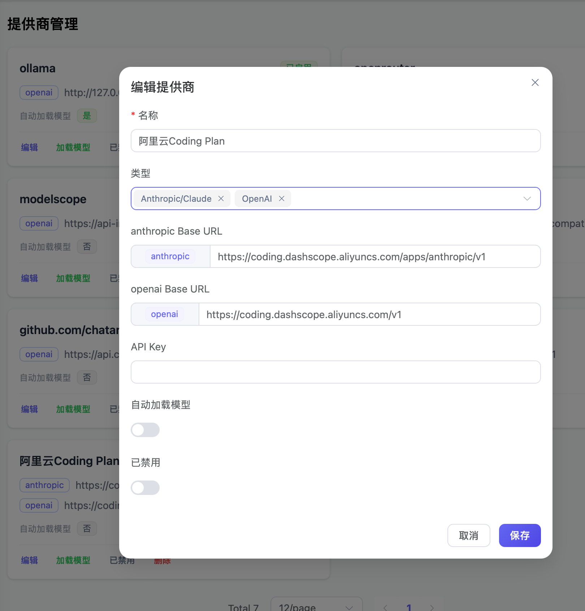

- 添加 API 提供商（OpenAI、Gemini、Claude 等）
- 配置 API 地址和认证信息
- 自动加载可用模型列表

#### 模型路由设置
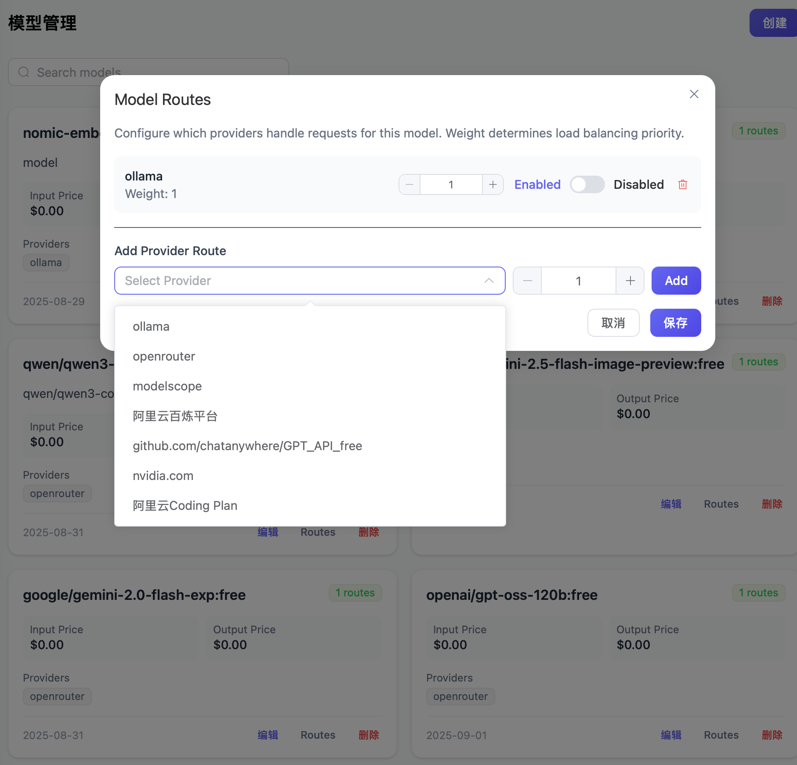

- 渠道管理：配置 API Key 和路由权重
- 模型管理：设置模型别名、价格、路由策略

#### 技能管理
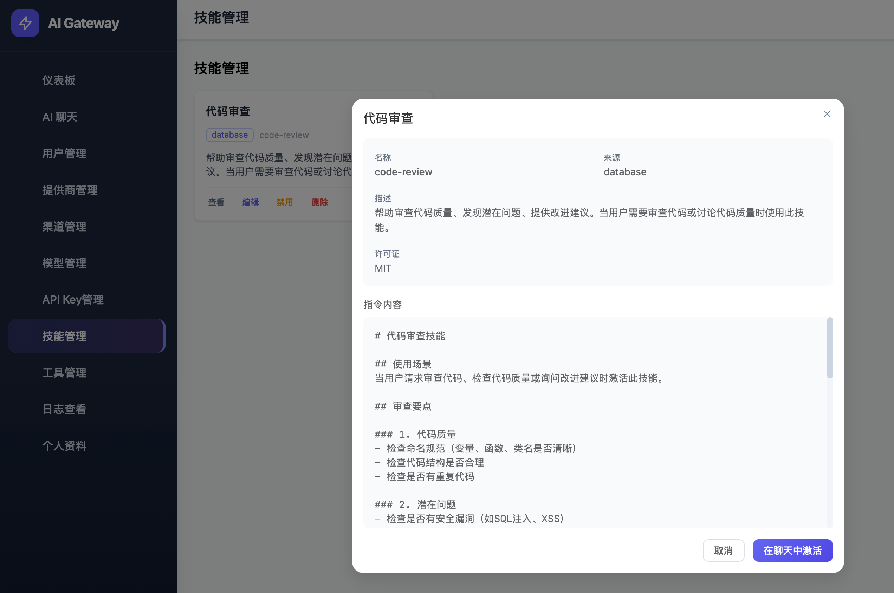

- 创建自定义技能（SKILL.md 格式）
- 扫描本地 `.agents/skills/` 目录导入技能
- 启用/禁用技能
- 技能激活：在聊天中使用技能增强 AI 能力

#### 工具管理
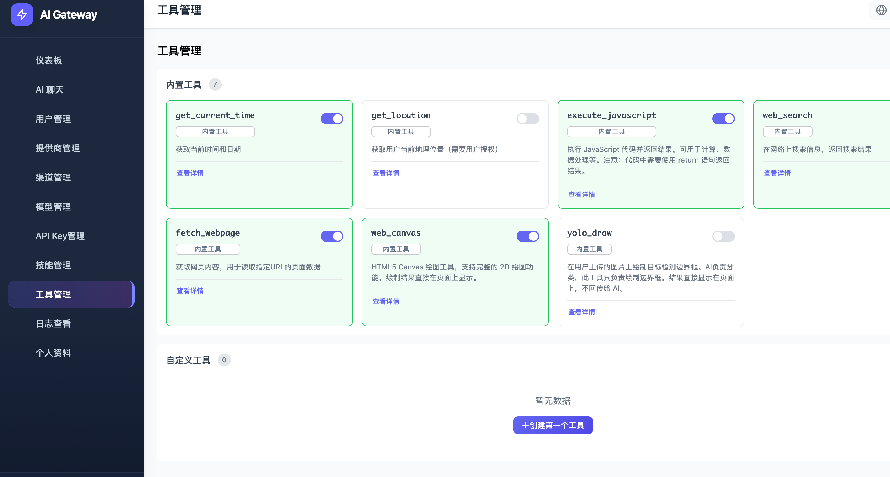

- 查看内置工具详情（参数支持 Markdown 格式说明）
- 启用/禁用工具
- 创建自定义工具（定义参数、编写执行代码）
- 测试工具执行

#### API Key 管理
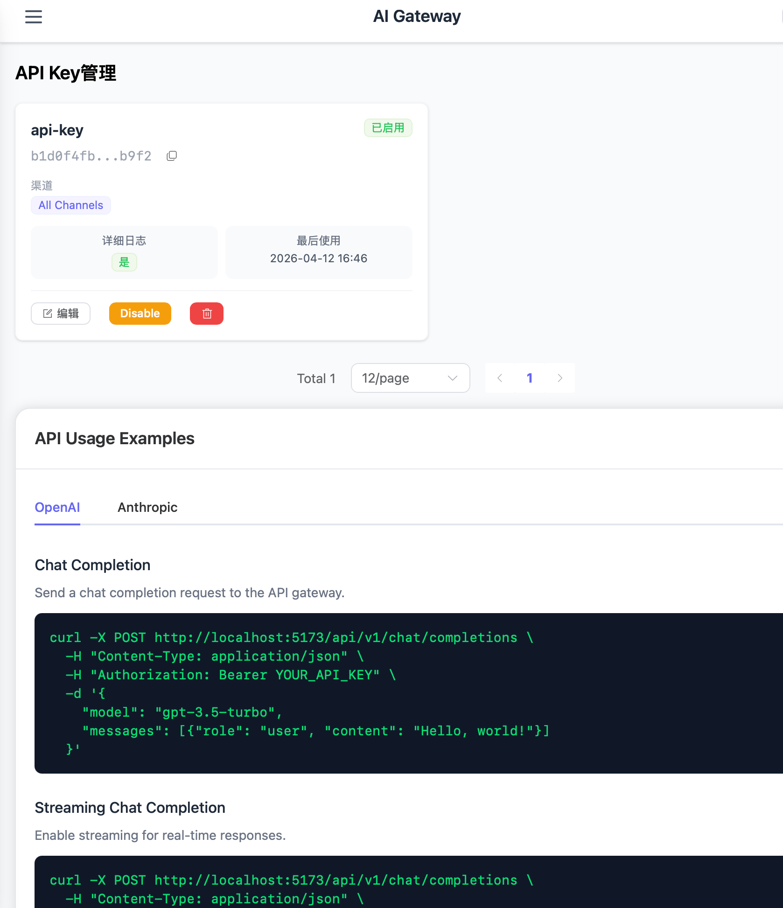

- 创建 API Key
- 绑定渠道权限
- 设置日志记录级别
- 查看使用统计

#### 日志查看
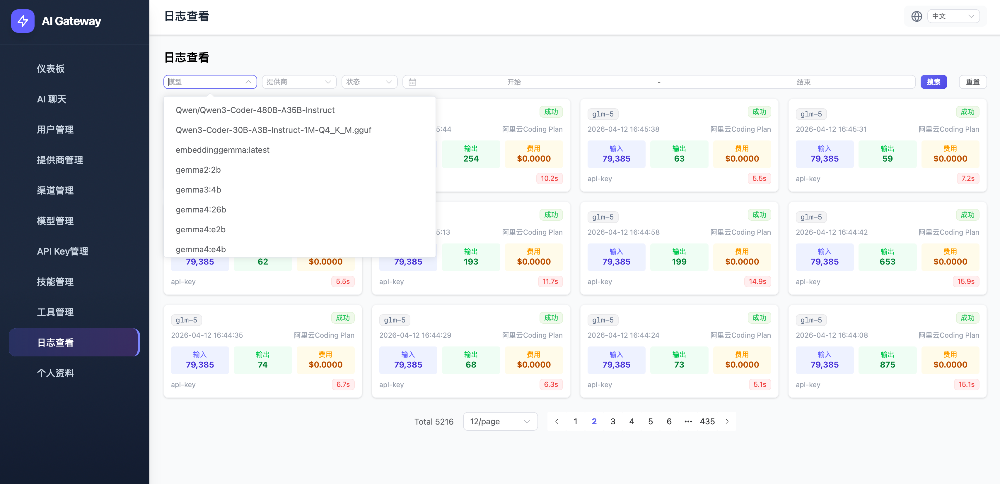
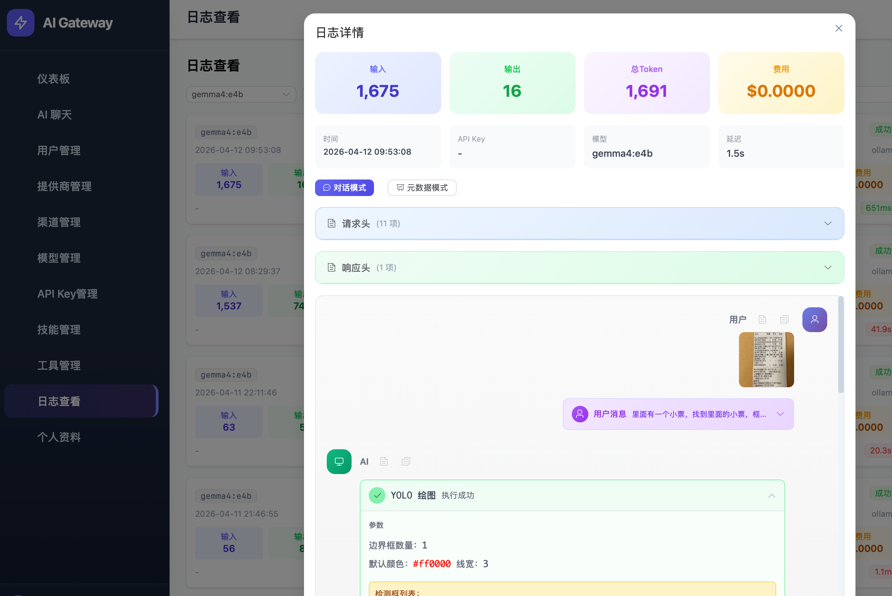
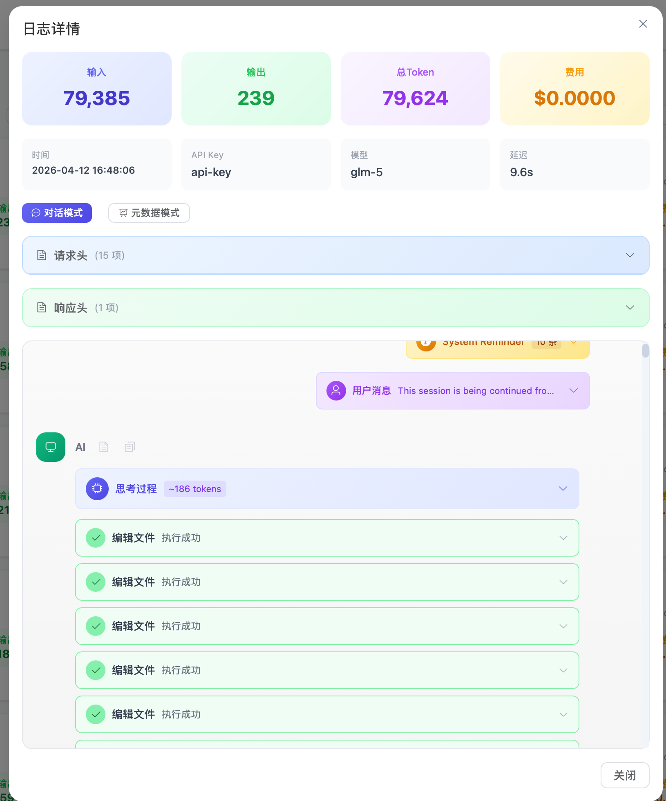

- 请求列表（时间、模型、Token、费用、状态）
- 详情查看（完整请求/响应内容）
- 支持多种 API 类型日志（Chat、Embeddings、Images）

#### 用户管理
- 用户列表（邮箱、角色、余额、状态）
- 创建/编辑用户
- 调整余额
- 禁用/启用账户

#### 个人中心
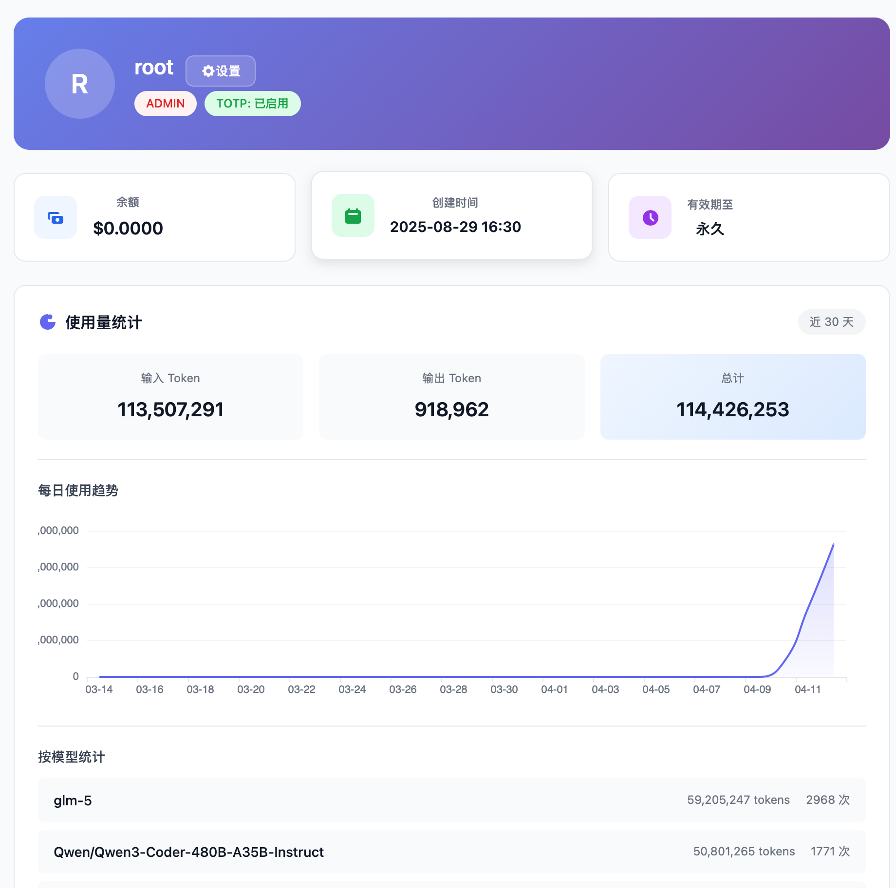

- 修改密码
- TOTP 双因素认证设置
- 个人信息展示

## 快速开始

### 环境要求

- Go 1.22+
- Node.js 20+ (仅开发/构建前端时需要)
- SQLite 3

### 编译运行

```bash
# 下载依赖
go mod tidy

# 构建前端（首次或前端有更新时）
cd web && npm ci && npm run build && cd ..

# 编译
go build -o ai-gateway ./cmd/server

# 运行
./ai-gateway
```

### Docker 部署

```bash
# 构建镜像
docker build -t ai-gateway .

# 运行容器
docker run -d \
  --name ai-gateway \
  -p 3000:3000 \
  -v ai-gateway-data:/app \
  -e JWT_SECRET=your-secret-key \
  ai-gateway

# 或使用 docker-compose
docker-compose up -d
```

### Docker 环境变量

| 变量 | 说明 | 默认值 |
|------|------|--------|
| `JWT_SECRET` | JWT 签名密钥，**强烈建议设置** | 馨次运行自动生成 |
| `HTTP_PROXY` | HTTP 代理地址 | 空 |
| `HTTPS_PROXY` | HTTPS 代理地址 | 空 |
| `NO_PROXY` | 不使用代理的地址 | 空 |

> **安全提示**: 如果不设置 `JWT_SECRET`，系统会在首次启动时自动生成一个随机密钥并存储在数据库中。但如果数据库丢失，用户将无法登录。建议在生产环境中设置固定的 `JWT_SECRET`。

### 默认管理员账户

首次运行时，系统会自动创建默认管理员账户：

- **用户名**: `root`
- **密码**: `root`

> **重要**: 请在生产环境中立即修改默认密码！

## 项目结构

```
ai-gateway/
├── cmd/server/main.go          # 应用入口
├── embed.go                    # 前端资源嵌入
├── configs/config.yaml         # 配置文件
├── VERSION                     # 版本号
├── internal/
│   ├── config/                 # 配置管理
│   ├── models/                 # 数据模型
│   ├── repository/             # 数据访问层
│   ├── service/                # 业务逻辑层
│   ├── handler/                # HTTP 处理器
│   ├── middleware/             # 中间件
│   └── utils/                  # 工具函数
├── web/                        # Vue 前端项目
│   ├── src/                    # 前端源码
│   │   ├── views/              # 页面组件
│   │   │   ├── chat/           # AI 聊天
│   │   │   ├── skills/         # 技能管理
│   │   │   ├── tools/          # 工具管理
│   │   │   ├── dashboard/      # 仪表盘
│   │   │   └── ...             # 其他管理页面
│   │   ├── components/         # 公共组件
│   │   ├── stores/             # Pinia 状态管理
│   │   ├── api/                # API 客户端
│   │   └── utils/              # 工具函数
│   └── dist/                   # 构建产物
├── go.mod
├── Dockerfile
└── Makefile
```

## API 端点

### 认证 API
- `POST /api/auth/login` - 用户登录

### 用户管理 API (需 JWT 认证)
- `GET /api/users` - 获取用户列表
- `POST /api/users` - 创建用户
- `GET /api/users/:id` - 获取用户
- `PUT /api/users/:id` - 更新用户
- `DELETE /api/users/:id` - 删除用户
- `PUT /api/users/:id/balance` - 调整余额

### 当前用户 API
- `GET /api/users/me` - 获取当前用户信息
- `POST /api/users/me/change-password` - 修改密码
- `POST /api/users/me/totp/setup` - 设置 TOTP
- `POST /api/users/me/totp/verify` - 验证 TOTP
- `POST /api/users/me/totp/disable` - 禁用 TOTP

### 提供商管理 API
- `GET /api/providers` - 获取提供商列表
- `POST /api/providers` - 创建提供商
- `GET /api/providers/:id` - 获取提供商
- `PUT /api/providers/:id` - 更新提供商
- `DELETE /api/providers/:id` - 删除提供商
- `GET /api/providers/:id/load-models` - 加载模型列表
- `POST /api/providers/:id/sync-models` - 同步模型

### 渠道管理 API
- `GET /api/channels` - 获取渠道列表
- `POST /api/channels` - 创建渠道
- `GET /api/channels/:id` - 获取渠道
- `PUT /api/channels/:id` - 更新渠道
- `DELETE /api/channels/:id` - 删除渠道

### 模型管理 API
- `GET /api/models` - 获取模型列表
- `POST /api/models` - 创建模型
- `GET /api/models/:id` - 获取模型
- `PUT /api/models/:id` - 更新模型
- `DELETE /api/models/:id` - 删除模型
- `GET /api/models/:id/routes` - 获取模型路由

### API 密钥管理
- `GET /api/keys` - 获取密钥列表
- `POST /api/keys` - 创建密钥
- `PUT /api/keys/:id` - 更新密钥
- `DELETE /api/keys/:id` - 禁用密钥

### 技能管理 API
- `GET /api/skills` - 获取技能列表
- `GET /api/skills/:id` - 获取技能详情
- `POST /api/skills` - 创建技能
- `PUT /api/skills/:id` - 更新技能
- `DELETE /api/skills/:id` - 删除技能
- `POST /api/skills/:id/toggle` - 启用/禁用技能
- `GET /api/skills/catalog` - 获取技能目录（用于聊天）
- `GET /api/skills/scan` - 扫描本地技能目录
- `POST /api/skills/import` - 导入本地技能

### 日志与统计
- `GET /api/logs` - 获取日志列表
- `GET /api/logs/:id` - 获取日志详情
- `GET /api/stats` - 获取统计数据
- `DELETE /api/cleanup/log-details` - 清理日志详情

### 工具执行 API
- `POST /api/tools/web-search` - 执行网络搜索
- `POST /api/tools/fetch-webpage` - 获取网页内容

### 网关 API (需 API Key 认证)
- `POST /api/v1/chat/completions` - 聊天补全（支持 OpenAI/Claude/Gemini 协议自动转换）
- `POST /api/v1/messages` - Claude Messages API 兼容接口
- `GET /api/v1/models` - 模型列表
- `POST /api/v1/embeddings` - 文本嵌入
- `POST /api/v1/images/generations` - 图像生成
- `POST /api/v1/audio/transcriptions` - 音频转录
- `GET /api/v1/dashboard/billing/usage` - 使用统计
- `GET /api/v1/dashboard/billing/subscription` - 订阅信息

## 配置

配置文件 `configs/config.yaml`:

```yaml
server:
  port: 3000
  mode: release

database:
  path: ai-gateway.db

auth:
  jwt_secret: ${JWT_SECRET}
  jwt_expiry: 8h

timeout:
  upstream: 240s
  model_load: 30s

proxy:
  http_proxy: ${HTTP_PROXY:}
  https_proxy: ${HTTPS_PROXY:}
  no_proxy: ${NO_PROXY:}
```

## 版本管理

版本号存储在 `VERSION` 文件中。发布流程：

1. 更新 `VERSION` 文件中的版本号
2. 推送到 main 分支
3. GitHub Actions 自动构建并发布 Docker 镜像

## 数据库

项目使用 SQLite 数据库，表结构与 TypeScript 版本完全兼容。

### 主要数据表
- `User` - 用户表
- `Provider` - 提供商表
- `Channel` - 渠道表
- `Model` - 模型表
- `ModelRoute` - 模型路由表
- `GatewayApiKey` - API 密钥表
- `Log` - 日志表
- `LogDetail` - 日志详情表
- `Settings` - 系统配置表
- `Skill` - 技能表
- `SkillResource` - 技能资源表

## 开发

```bash
# 运行开发模式（后端）
go run ./cmd/server

# 运行前端开发服务器
cd web && npm run dev

# 运行测试
go test -v ./...

# 运行前端测试
cd web && npm run test:run
```

## 许可证

MIT License